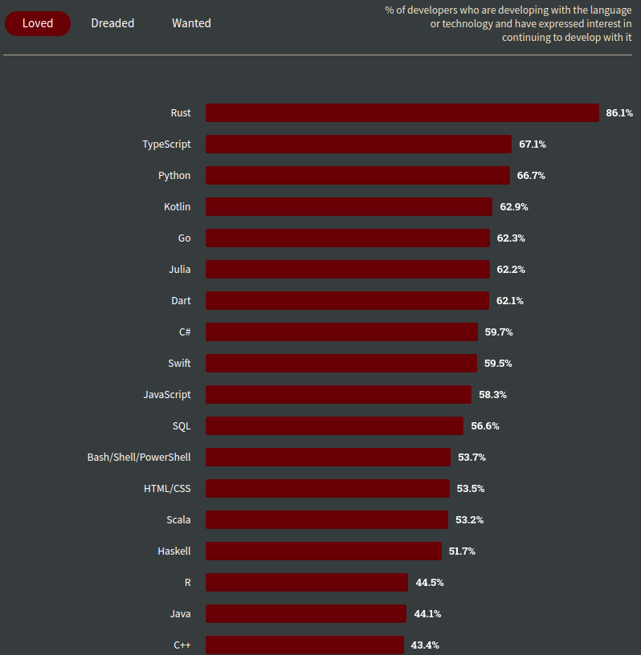
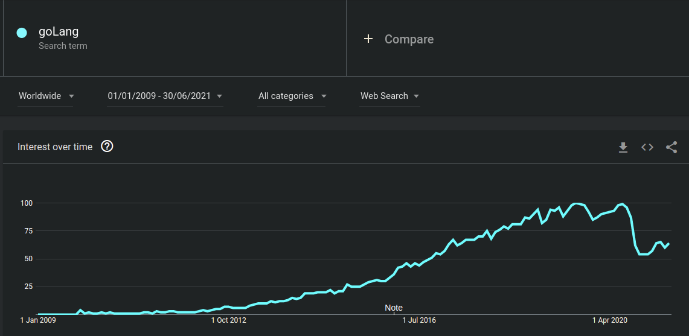

# Why Use the Go Language for Your Project?


If you’re planning to create or streamline an app for your business, start by choosing the proper technology. In a world of speedy changes, business owners often resort to `Ruby` as it allows them to create an app truly fast. But why use Golang?

## What is Go?
***
`Go` is an open source programming language that makes it easy to build simple, reliable, and efficient software. It’s statically typed and produces compiled machine code binaries. Developers say that Google's `Go` language is the C for the twenty-first century when it comes to syntax. 

The world was first introduced to `Go` in 2009 thanks to Google’s Rob Pike, Robert Griesemer, and Ken Thompson. The main goal of creating `Go` was to combine the best features of other programming languages:

- Ease of use together with state-of-the-art productivity

- High-level efficiency along with static typing

- Advanced performance for networking and the full use of multi-core power

## What are the Advantages of Using `Go` for Your Project?
***

* ### Minimalist and easy to learn
Golang’s specification is merely 50 pages long (Java’s, for example, is 750 pages long) and it’s full of examples. The language is quite easy to read and easy to learn from just this specification (and even more so if you are already well-versed in `Java` or `C`). Moreover, its clean syntax means the language is also easy to maintain. Some of the features that make `Go` so simple include a minimal interface, no implicit conversions, and packages with clear code separation.

```
HELLO WORLD IN JAVA
class HelloWorldApp {
    public static void main(String[] args) {
        System.out.println("Hello World!"); // Prints the string to the console.
    }
}

HELLO WORLD IN GO
package main

import "fmt"

func main() {
    fmt.Println("Hello, World")
}
```

* ### Convenience
`Go` has been compared to scripting languages like `Python` in its ability to satisfy many common programming needs. Some of this functionality is built into the language itself, such as “goroutines” for concurrency and threadlike behavior, while additional capabilities are available in `Go` standard library packages, like Go’s http package. Like `Python`, `Go` provides automatic memory management capabilities including garbage collection.
Unlike scripting languages such as `Python`, `Go` code compiles to a fast-running native binary. And unlike `C` or `C++`, `Go` compiles extremely fast—fast enough to make working with `Go` feel more like working with a scripting language than a compiled language. Further, the `Go` build system is less complex than those of other compiled languages. It takes few steps and little bookkeeping to build and run a `Go` project.

* ### Fast
`Go` binaries run more slowly than their `C` counterparts, but the difference in speed is negligible for most applications. `Go` performance is as good as `C` for the vast majority of work, and generally much faster than other languages known for speed of development (e.g., `JavaScript`, `Python`, and `Ruby`).

* ### Transparent
Go’s syntax is meant to be transparent. It has only one standard code format created automatically by the `fmt` tool. The language makes it easy for you to always know what your code is doing and estimate resources. Languages like `Python` are as readable as `Go`, but not quite as transparent.

* ### Large community = Extensive tools
As with most popular programming languages, Golang has a large and supportive community. The language has its own `GitHub` repository, which includes a number of editors and plugins, and there are also many other resources available, including a Slack channel, a blog, a sub-Reddit and a forum. And if that isn’t enough, there are countless Golang programmers out there open to share their knowledge.

* ### Large talent pool
The fact Golang has such a large community also means there are countless developers offering Golang development services. As the most in-demand language in the world, you are sure to have your pick of developers if you’re looking to start a project using `Go`.
 


* ### Always compatible
Golang offers excellent backward compatibility so, if you develop an app with its current version, you should not have problems with new versions in the future. Go’s compatibility means switching versions of the language at any time should be hassle-free.

* ### Scalable
Golang’s advantages includes Goroutines—functions that run simultaneously and independently—, which take little memory space and make it scalable when dealing with several concurrent processes. You can actually run millions of Goroutines without crashing your system, making for a leaner software.

* ### Built-in testing
`Go` includes a built-in testing tool, which, just like everything else regarding this language, was created with simplicity and efficiency in mind. It can be used for various types of testing and profiling, and you can even run tests in parallel, among many other features.

## What are the Disadvantages of `Go`?
***

* ### A young language, so it is still developing
Being a very young language, developers might find it difficult to make maximum use of the libraries. They might have to write the libraries themselves and there aren’t many books or online courses to help, while in doubt.

* ### The size of the generated binaries. 
`Go` binaries are statically compiled by default, meaning that everything needed at runtime is included in the binary image. This approach simplifies the build and deployment process, but at the cost of a simple “Hello, world!” weighing in at around 1.5MB on 64-bit Windows. The `Go` team has been working to reduce the size of those binaries with each successive release. It is also possible to shrink `Go` binaries with compression or by removing `Go`s debug information. This last option may work better for stand-alone distributed apps than for cloud or network services, where having debug information is useful if a service fails in place.

* ### Error handling isn’t perfect
Though error handling is not perfect in `Go`, the imperfectness of it could get you. Solutions are still being searched for, and proposals have come up for error handling.

* ### Runtime safety is not that good
`Go` is safe, but it doesn’t deliver the level of the safety that `Rust` provides. The safety level is compile-time only and to a certain extent runtime. Go focuses on the speed of production, and `Rust` concentrates on the safety aspect.

Other cons include operator overloading, and problems in code duplication and metaprogramming because those cannot be statically checked.

## What projects should you use `Go` for?
***
`Go` will definitely do the trick if you’re planning to develop the underlying services for your app. More than that, `Go` is good for scalable high-performance apps. Below, we list some apps and services that are enjoying the benefits of `Go` to the max.

* ### Cloud services
As the creator of `Go`, Google is using this language to provide cloud infrastructure: it offers top performance and scalability to the Google Cloud Platform. But there are even more well-known cloud businesses out there using Go for the same reasons: Dropbox, Terraform, Kubernetes, and Docker.  

* ### Media platforms  
YouTube, SoundCloud, and Netflix chose Go to fight with high loads on their sites. SoundCloud uses this language for deploying some internal services within their complex projects.

* ### News outlets
Back in 2012, the BBC (yep, it was a surprise to us too) started using Go for backend development and some of the elements of their internal analytics services.

* ### On-demand services
The taxi giant Uber was looking to improve map processing speeds as people loaded geofence lookups, sending literally thousands of queries per second. Go helped Uber significantly reduce the timing of providing services to users, which was much appreciated by users.

Aside from the services and products, `Go` provides good tooling for mobile app development. This is why we’ll soon see even more examples of Go in mobile apps and probably in some other industries as well.

Although `Go` is still a relatively young programming language, it has gained popularity among real business monsters like Google, Netflix, Uber, and others who use Go to scale their products and achieve high performance. Go is quickly changing for the best, providing more and more tools for mobile and web development and remarkably decreasing the time and costs of app development and support. 

## Go Language Futures
***
The next phase in Go development may well be driven more by the wants and needs of its developer base, with Go’s minders changing the language to better accommodate this audience, rather than just leading by stubborn example. In other words, Go may gain the features that were originally not intended for it, like generics.



It’s clear Golang developers want these things. The 2018 Go user survey placed generics among the top three challenges in the way of broader Go adoption, along with better dependency and package management. And an existing proposal on GitHub for generics remains active as a proposal for Go 2.x. Changes like these may help Go take a more central place in enterprise development, where Java, JavaScript, and Python currently reign supreme.

Even without major changes, we can expect increased use of Go for infrastructure rebuilding projects, as per the replacements for SSH and NTP described above, and as part of multi-language projects. 

Third-party implementations of the Go toolchain have also proliferated. ActiveState’s ActiveGo provides a commercially supported edition of the Go language, and both the LLVM and gccgo projects provide liberally licensed open source implementations of Go by way of alternative toolchains.

Finally, Go has also served as a base for developing entirely new languages, although two examples of this have ceased active development. One example was the Have language, which streamlined Go syntax, implemented some of the same concepts in its own way, and transpiled to Go for easy execution. Another defunct project, Oden, used Go’s assembler and toolchain to compile a newly designed language that took additional inspiration from languages like Lisp and Haskell.

This last set of projects illustrate one of the ways any IT innovation becomes truly revolutionary—when people take it apart and repurpose it, finding uses its designers never intended. The future of the Go language as a hackable project is just getting started. But its future as a major programming language is already assured, certainly in the cloud, where the speed and simplicity of Go ease the development of scalable infrastructure that can be maintained in the long run.